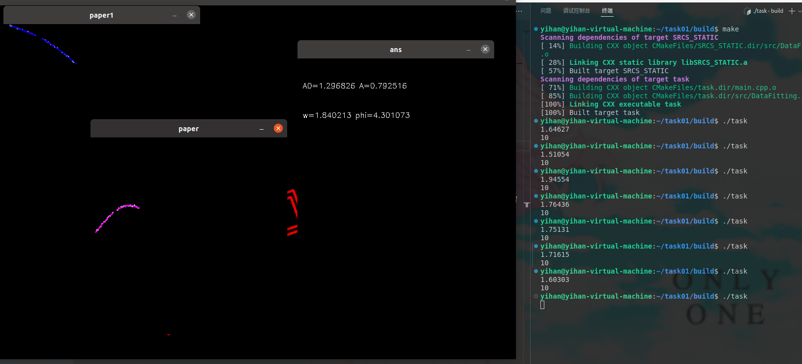

# 任务概要

本任务要求大家在本程序的main函数中的“代码区"中书写代码（可以额外添加其他程序文件），识别Mat src图像中的：

并使用cv::circle在长方形与R的中间绘制一个圆形，同时计算单次循环识别的时间(这一点并不十分关键，毕竟和设备有关)

其中图像中的风车（能量机关）将以正弦速度旋转，同时为了考虑现实中的观测噪声，我们为其添加了一定的噪声，其公式大致为：

$$
v=A\sin{(\omega t + \alpha)}+b
$$

为大家提供三档要求：

- 识别能量机关标靶
- **拟合**能量机关旋转各参数，且已知参数范围（查看源码获得参数）
- **拟合**能量机关旋转各参数（请勿直接查看源码获得参数）

我们会检查大家的代码以确定大家的到底处于哪一档

### Re:
##### 真是一场酣畅淋漓的造史啊！

##### 理论分析：

拟合的准确性直接来源于窗口的宽窄，还有我们伟大的**ceres solver**内部神奇的 *增量计算*
识别单帧的时间其实无所谓，甚至很快，拟合也是，运行的很快。
主要是能量机关客观转速约为
 $$
 1.305+0.785cos(1.884t+0.24) 
 $$   
 这意味着机关转$\frac{1}{4}$圈,需要1.3s左右，所以理想的单次拟合时间应该是1.5s。

 ##### 实现逻辑：
 菜菜的我不会自己写个solver来拟合，只能调用库了。
 由于$Acos(\omega t+\phi)$相对于$A_0$为波动项，所以绝对角度$\theta$关于$t$的函数为一条直线，可以先拟合$A_0$，再拟合波动项$A,\omega,\phi$ 。
 ###### 但是我比较菜，调了好久参数结果拟合效果跟史一样。
 两次拟合后的参数除了$\phi$基本满足真值要求，$\phi$客观模型原因还原不出来了，
 但是采用相对时间来预测角度是不影响的。
 此外，对于一些曲线，由于ceres solver神奇的迭代算法，会导致$\omega$的拟合莫名其妙越过1.884跑向无穷大的远方（20，30...），这个时候就寄了。
 ###### 所以最终采用多组来拟合，总测试组数为10，中间拟合的组数若不满足要求直接杀了，重新采样，不会减去这部分时间，这样得到的平均时间是兼顾稳定性的时间。
 ###### 实测大概是1.7s左右。（50个点取样一次）

##### 结果：

###### 其中paper用来观测拟合效果（三角项），paper1用来观测绝对角度拟合效果，ans是拟合答案，终端输出平均时间和测试组数N，识别的点已经用蓝点标在图中了。
